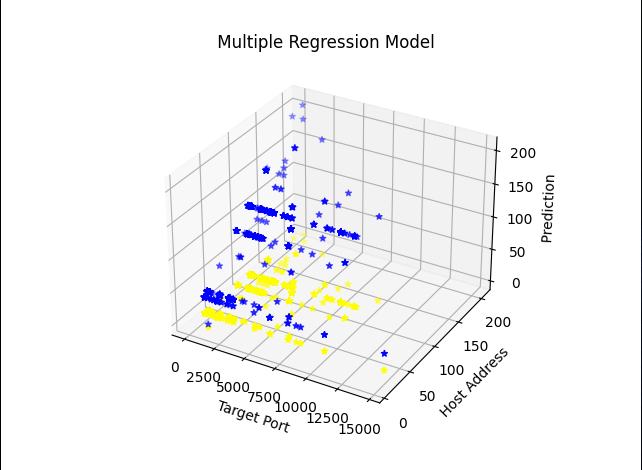

# Botnet Attack Detection

## Contents
- [Introduction](#introduction)
- [Overview](#overview)
- [Methodology](#methodology)
- [Results](#results)
- [References](#references)

## Introduction

This repository contains various machine learning algorithms to detect botnet. A botnet is a number of Internet-connected devices, each of which runs one or more bots. It can be used to perform Distributed Denial-of-Service (DDoS) attacks, steal data, send spams and allow the hacker to access the device & its connection.

> What Is a DDoS Attack? 
A DDoS attack is a cyberattack in which multiple compromised systems attack a given target, such as a server or website, to deny users access to that target. 
Attackers often use compromised devices — desktops, laptops, smartphones or IoT devices — to command them to generate traffic to a website in order to disable it, in ways that the user does not even detect.
The malware then visits or sends special network packets (OSI Layer 7 and Layer 3, respectively) to the DNS provider. The attack then generates what looks like, to most cybersecurity tools, normal traffic or unsuccessful connection attempts.

> What Is a Botnet Attack? 
A botnet is a simply a group of connected computers working together to execute repetitive tasks, and can keep websites up and running. Malicious botnets use malware to take control of internet-connected devices and then use them as a group to attack.

* __Note:__ The dataset named `data.csv` can be found in the repository. 

## Overview
> This project is developed by [Ravi Patel](https://linkedin.com/in/ravi-patel-608178207 "Ravi Patel") for the  [Microsoft Engage Cybersecurity 22'](https://www.acehacker.com/microsoft/cybersecurity/ "Microsoft Engage Cybersecurity") as a part of research on the topic `Protecting Critical Infrastructure (Power Grid) from the next Stuxnet`. 
> This project aims to make the Critical Infrastructure more secure by exploring major vulnerabilities and also suggesting measures to avoid exploitation of any kind. 

## Methodology

1. Introduction to Dataset   

    | S. No.  | Features |  
    | -: | -: |  
    | 1 | Serial Number |  
    | 2 | Botnet ID |  
    | 3 | Source IP Addresses |  
    | 4 | Source Port Addresses |  
    | 5 | Source IP ASN Number |  
    | 6 | Target IP Address |
    | 7 | Targer Port Address |  
    | 8 | Source IP Region |  
    | 9 | Source IP City |  
    | 10 | Source IP Latitude |  
    | 11 | Source IP Longitude |  
    | 12 | Threat Confidence |  

2. Encoding of Categorical Data
In python using LabelEncoder and OneHotEncoder from sklearn’s preprocessing
Library I encoded the “Threat Confidence Column [12]” in 0 and 1 for Low and High  

    | Threat Confidence | Threat Classify |  
    | -: | -: |  
    | High | 1 |  
    | Low | 0 |  

3. Extracting the Host Address   
Address from the Target IP Address
As all the `Target IP` are of the type `204.95.99.xx`, so I created another coloumn containing just the `Host Address`.  

    | Target IP | Host Address |
    | -: | -: |
    | 204.95.99.31 | 31 |  
    | 204.95.99.86 | 86 |  
    | 204.95.99.109 | 109 |
    | 204.95.99.26 | 26 |  

4. Applying `Multiple Regression`  
Applying Multiple Regression to the data, the most relevant columns i.e. Target Port, Address and Target Host Address as independent variables. I applied regression on threat classification and considered value greater than 0.9 as 1 or otherwise 0.
The graph plotted from it is:
 

Here, `X-axis`: Target Port Address   
`Y-axis`: Target Host Address  
`Z-axis`: Threat variable  
`Blue points`: Actual results  
`Red points`: Predicted results  
`Purple points`: Exact Intersection  

## Results

Following Classification algorithms were applied  
1. K - Nearest Neighbour Classification   
2. Support Vector Machine Classification  
3. Kernel Support Vector Machine Classification  
4. Decision Tree Classification  
5. Random Forest Classification  

Following table contains the details about accuracy and wrong predictions.

| Classification Algorithm | Wrong Predictions | Accuracy |
| -: | -: | -: |
| Naive Bayes Classification | 24 | 94.520% |
| Support Vector Machine Classification | 20 | 95.215% |
| Kernel Support Vector Machine Classifiaction | 16 | 96.208% |
| Random Forest Classification | 5 | 98.845% | 
| Decision Tree Classification |  0 | 100% |

As evident from the table, `Decision Tree` classifiaction gives the best accuracy.

## References
> - Alshamkhany, Mustafa & Alshamkhany, Wisam & Mansour, Mohamed & Dhou, Salam & Aloul, Fadi. (2020). [Botnet Attack Detection Using Machine Learning](https://www.researchgate.net/publication/347445002_Botnet_Attack_Detection_Using_Machine_Learning). 10.1109/IIT50501.2020.9299061.
> - Dong, Xiaxin & Hu, Jianwei & Cui, Yanpeng. (2018). [Overview of Botnet Detection Based on Machine Learning](https://www.researchgate.net/publication/329067496_Overview_of_Botnet_Detection_Based_on_Machine_Learning). 476-479. 10.1109/ICMCCE.2018.00106. 